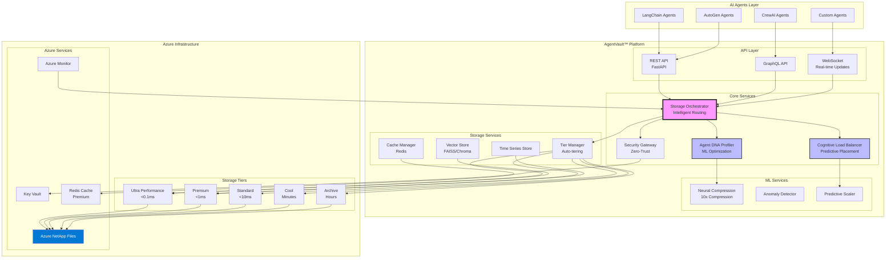
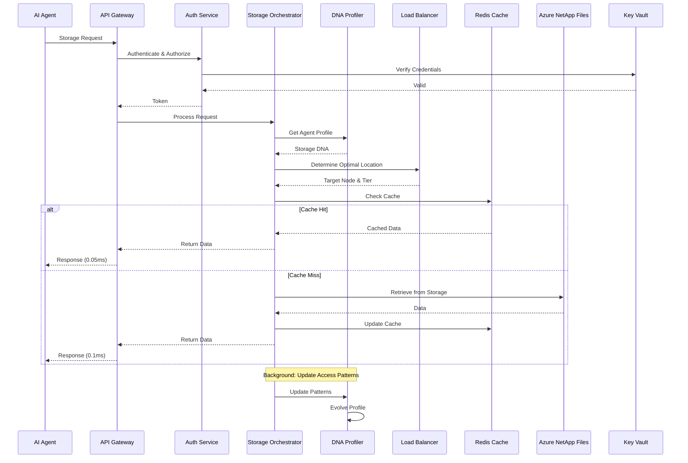
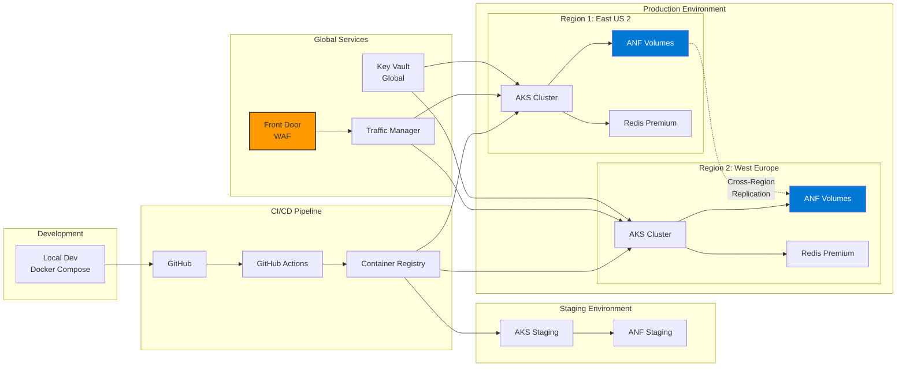
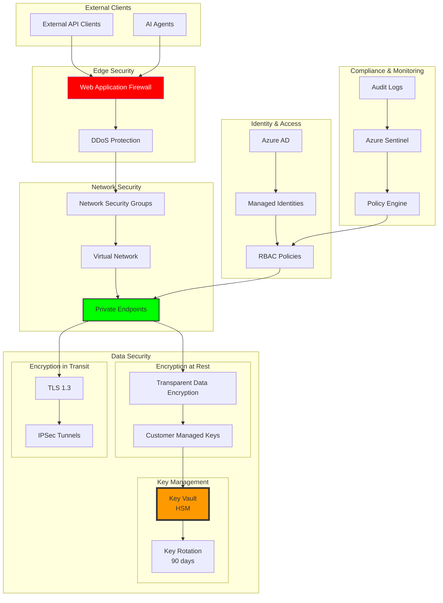
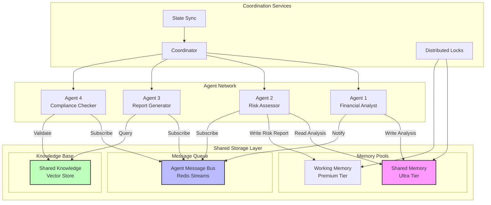

# AgentVault™ Architecture Diagrams

## System Architecture

## Data Flow Diagram

## Deployment Architecture

## Security Architecture

## Performance Optimization Flow

```mermaid
graph LR
    subgraph "Request Analysis"
        REQ[Incoming Request]
        ANALYZE[Analyze Pattern]
        PREDICT[Predict Next Access]
    end

    subgraph "Optimization Engine"
        DNA[Storage DNA]
        ML[ML Models]
        CACHE[Cache Strategy]
        TIER[Tier Selection]
    end

    subgraph "Execution"
        ROUTE[Smart Routing]
        PREFETCH[Pre-fetch Data]
        COMPRESS[Neural Compression]
        DELIVER[Deliver Response]
    end

    subgraph "Feedback Loop"
        MEASURE[Measure Performance]
        LEARN[Update Models]
        EVOLVE[Evolve DNA]
    end

    REQ --> ANALYZE
    ANALYZE --> PREDICT
    PREDICT --> DNA
    
    DNA --> ML
    ML --> CACHE
    ML --> TIER
    
    CACHE --> ROUTE
    TIER --> ROUTE
    ROUTE --> PREFETCH
    PREFETCH --> COMPRESS
    COMPRESS --> DELIVER
    
    DELIVER --> MEASURE
    MEASURE --> LEARN
    LEARN --> EVOLVE
    EVOLVE --> DNA

    style ML fill:#bbf,stroke:#333,stroke-width:2px
    style DNA fill:#f9f,stroke:#333,stroke-width:2px
    style DELIVER fill:#0f0,stroke:#333,stroke-width:2px
```

## Multi-Agent Collaboration Flow

---

## Legend

### Colors
- 🟪 Purple: Core Services
- 🟦 Blue: ML/AI Components  
- 🟩 Green: Security Features
- 🟧 Orange: Critical Infrastructure
- 🟥 Red: Security Perimeter

### Shapes
- Rectangle: Services/Components
- Diamond: Decision Points
- Circle: Data Stores
- Hexagon: External Systems

### Lines
- Solid: Primary Data Flow
- Dashed: Replication/Backup
- Thick: Critical Path
- Arrow: Direction of Flow